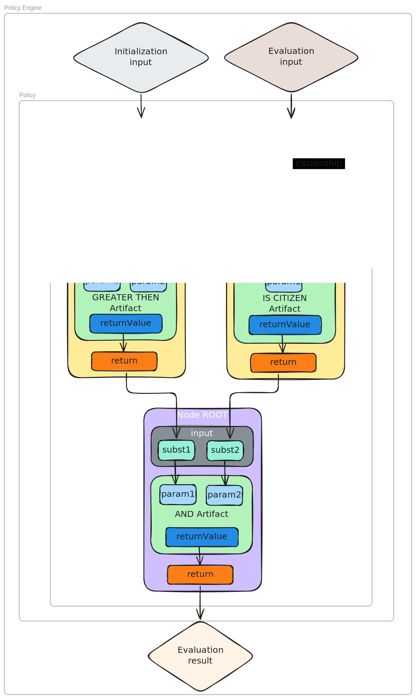

## Abstract

This proposal presents an efficient on-chain policy engine approach. Policies are decomposed into simple rules, called artifacts, and represented as a directed acyclic graph (DAG). Each DAG node is an instance of an artifact. The DAG is recursively evaluated starting from a top-tier artifact (root node), effectively processing it as a tree. The evaluation result serves as the final policy evaluation outcome.

The standard defines approaches, interfaces, and conventional traits that facilitate elegant interoperability between policies and artifacts for common usage scenarios, enabling seamless implementation and consumption of any compliance scenario.

## Motivation

Many software systems rely on smart contracts, ranging from simple vaults to decentralized exchanges and oracles. All such systems require regulation in various forms - limiting administrative privileges, restricting allowed methods, capping withdrawal amounts. Restrictions, rules, and prohibitions constitute essential components of any financial (or other) system.

Current smart contract programming approaches allow for the creation of simple rules through algorithmic constraints and modifiers. However, more complex rules - dynamic, composite, or conditional - become increasingly difficult to implement as the number of inputs grows. Moreover, certain problems, such as interactive composition of simple rules, cannot be addressed with current methods due to the lack of reflection capabilities in smart contract platforms. Reusing complex rules, modifying them dynamically, and hierarchical organization are similarly challenging.

When developing compliance conditions, developers face several important challenges. Code complexity becomes a daunting concern beyond simple value thresholds, making codebases harder to maintain, understand, and audit. Security flaws in rule implementation can lead to unauthorized access, fund loss, or regulatory problems. Integration of new compliance logic into existing codebases often requires extensive changes, with copy-paste approaches duplicating code and requiring separate integration work.

Many compliance patterns appear across different projects but lack standard interfaces, forcing developers to repeatedly implement similar functionality. As regulatory requirements change, contracts need updates, requiring the entire development process again - writing, testing, auditing, and deploying - increasing costs and error potential.

This proposal establishes a standard enabling simplicity, reusability, and comprehensive compliance capabilities without requiring network layer modifications. The standard addresses these challenges by simplifying integration through standardized interfaces, allowing security responsibility assignment to artifact developers, and containing rule complexity within artifacts. Common patterns can be implemented once and reused across multiple policies, while regulatory changes can be addressed by adding or replacing specific artifacts rather than rebuilding entire applications diving into a new and complete dapp development life cycle from scratch.

This approach enables sophisticated compliance systems that were previously impractical to implement, unlocking new possibilities for on-chain governance and regulatory compliance.

## Specification

The key words "MUST", "MUST NOT", "REQUIRED", "SHALL", "SHALL NOT", "SHOULD", "SHOULD NOT", "RECOMMENDED", "NOT RECOMMENDED", "MAY", and "OPTIONAL" in this document are to be interpreted as described in RFC 2119 and RFC 8174.

### Definitions

**Policy** - A rule or set of rules combined to form one coherent rule. A policy is defined in relation to the action to which it applies. For example, a bank transfer must comply with the bank's policy for that specific transfer type. This policy may be a single rule or a composite of several rules. Furthermore, a policy may be composed of several other policies, which in this context are treated as rules.
To summarize, a policy is a rule governing a specific transaction, regardless of its complexity.

In this standard, the fundamental component of a policy is called an **artifact**. An artifact is also a rule, but it is atomic within the policy context. Internally, an artifact can be as simple or complex as its creator requires.

For example, a policy stating "be over 21 years old and a citizen" comprises two artifacts: "be over 21 years old" and "be a citizen". While one could define a single artifact encompassing both requirements, it is generally recommended to maintain granularity that reflects natural divisions of logic.

Artifacts in this proposal are implemented as smart contracts, allowing them to represent not only rules but also arbitrary transactions. Consequently, logical operators like "and" are also implemented as artifacts.

This construction system - which allows for modifying components and dynamically supplying them with data - is defined by this standard.


### Artifact Interfaces

Artifacts may implement any logic but MUST adhere to a standard interface that allows the policy controller to integrate them correctly and ensure consistent data flow:

```solidity
interface IArbitraryDataArtifact {
    function exec(bytes[] memory data) external returns (bytes memory);

    function init(bytes memory data) external;

    function getExecDescriptor()
        external
        pure
        returns (string[] memory argsNames, string[] memory argsTypes, string memory returnType);

    function getInitDescriptor()
        external
        pure
        returns (string[] memory argsNames, string[] memory argsTypes);

    function description() external pure returns (string memory desc);
}
```

Other interfaces are more implicit, following conventions and approaches explained in the Rationale section.

### Policy Handler

The policy handler serves as the orchestration component for artifact execution. While implementations may vary, this standard RECOMMENDS a Directed Acyclic Graph (DAG) approach as the most efficient architecture.

During policy initialization, the handler constructs a DAG from the specified artifacts and their configurations. Each artifact instance is initialized as needed during this phase, ensuring proper setup before policy evaluation.

When policy evaluation is requested, the handler:
1. Receives the root node identifier (referencing the starting artifact instance in the policy)
2. Collects the necessary variables for evaluation
3. Initiates a recursive traversal of the graph

For each node in the traversal, the handler:
1. Calls the target artifact using the standard interface
2. Supplies it with the appropriate variables and results from previously calculated nodes
3. Collects the result for use by subsequent nodes

This orchestration allows artifacts to exchange data without direct knowledge of each other. After complete traversal, the root node contains the result of the entire policy evaluation.



To facilitate interaction with off-chain systems, the handler SHOULD provide a method to retrieve information about all variables used by all artifacts in the policy:

```solidity
function getVariablesList() public view returns (NamedTypedVariables[] memory) {
    return Utils.getVariablesListInternal(graph.getNodes());
}
```

## Rationale

Since rules often require heterogeneous data (both on-chain and off-chain), the system must facilitate integration from both sources. This integration is achieved through the artifact handler architecture, which properly organizes artifacts and data to compute policies correctly. Essentially, an instance of the handler represents an instance of the policy.

### All bytes

Artifacts, being contracts, require clearly typed method arguments. However, the handler cannot process all types uniformly. To avoid extensive ad hoc duplications, all types SHOULD be encoded into bytes before being supplied to and returned from artifacts.

This approach allows each variable or result of an artifact to be processed as bytes by both the handler and off-chain code, significantly simplifying implementation.

### Artifact dataflow traits

Artifacts have two primary methods: `init` and `exec`.

The `init` method is called once during policy initialization by the handler. Since artifacts can be reused across multiple policies, each new policy creates its own copy of each artifact requiring initialization using some copying strategy (e.g. [ERC-1167](./eip-1167.md)). This ensures that each artifact instance maintains a clean state.

Both `init` and `exec` methods accept arguments (with `exec` also returning a value). Following the "all bytes" approach, these arguments are encoded as bytes. However, their serialization differs: `exec` arguments are an array of byte-encoded values, while `init` arguments are directly byte-encoded values:

```
exec args = [abi.encode(uint256), abi.encode(string)]
init args = abi.encode(uint256, string)
```

These values SHOULD be decoded accordingly:

```solidity
function exec(bytes[] memory data) external pure override returns (bytes memory) {
    uint256 argA = abi.decode(data[0], (uint256));
    string memory argB = abi.decode(data[1], (string));

    return abi.encode(doSomething(argA, argB));
} 
```

```solidity
function init(bytes memory data) external override {
    (bool init1, address init2, bytes memory init3, uint256 init4, string memory init5) = abi
        .decode(data, (bool, address, bytes, uint256, string));
}
```

### External compliance traits

Artifacts SHOULD be self-descriptive to facilitate integration.

The `description` method returns a human-readable string describing the artifact's logic - its purpose, state characteristics, applicable contexts, and other relevant information. While not strictly formatted, this description helps developers and users understand the artifact's behavior and intended use:

```solidity
function description() external pure override returns (string memory desc) {
    desc = "Stateful artifact used to validate signatures from a predefined list of approvers. Requires a quorum of valid signatures to approve. First parameter - messageHash packed as bytes, second one - signatures packed as bytes array. Returns bool representing whether enough valid signatures were provided.";
}
```

In contrast, the `getExecDescriptor` and `getInitDescriptor` methods are designed for automated systems that need to encode arguments for policy computation. These methods provide structured metadata about parameter names, types, and return values in a machine-readable format:

```solidity
function getExecDescriptor()
    public
    pure
    override
    returns (string[] memory argsNames, string[] memory argsTypes, string memory returnType)
{
    uint256 argsLength = 2;
    argsNames = new string[](argsLength);
    argsNames[0] = "argA";
    argsNames[1] = "argB";
    argsTypes = new string[](argsLength);
    argsTypes[0] = "uint256";
    argsTypes[1] = "uint256";
    returnType = "bool";
}
```

This separation of concerns allows both human users and automated systems to properly interact with artifacts, supporting both manual integration and programmatic composition of policies.

### Handler Architecture Considerations

The graph-based approach is optimal for artifact orchestration, offering elegant recursive traversal capabilities, memory efficiency, and support for dynamic modifications. Artifacts function naturally as node logic within this structure, with the handler defining additional node properties and relationships.

A key responsibility of the handler is parameter management. The handler determines:
- Which parameters are constant within the policy
- Which parameters are supplied as external variables
- Which parameters derive from the computation results of other nodes

These determinations are made during policy creation and dynamically managed by the handler during execution. Implementation details regarding interface extensions and argument formatting remain at the discretion of the handler developer.

The graph-based architecture imposes several important constraints:

1. **Acyclicity requirement**: Policies MUST NOT contain cycles. Nodes cannot refer to each other cyclically in any form, including self-references and transitive references.

2. **EVM call stack limitations**: Since each node traversal involves a contract call to an artifact, policy size is bounded by Ethereum Virtual Machine call stack limits.

3. **Connectivity requirement**: Only nodes connected (directly or indirectly) to the root node will be traversed during evaluation. Disconnected nodes or subgraphs will be ignored during traversal, though their presence does not cause policy failures.

## Test Cases

Test cases for this standard are included in the reference implementation repository. They demonstrate:

1. Creation and initialization of artifacts
2. Construction of policies from multiple artifacts
3. Evaluation of policies with various input data
4. Reuse of artifacts across different policies
5. Implementation of common policy patterns and composite structures

## Backwards Compatibility

No backward compatibility issues have been identified.

This standard may appear associated with [ERC-2746](./eip-2746.md), but they are not intended as replacements for each other. While ERC-2746 describes a similar concept of rule perception, the current standard presents a fundamentally different approach to implementing a rule engine on-chain, with entirely distinct interfaces and mechanisms, while being simpler to apply and more powerful in usage.

## Reference Implementation

A reference implementation of policy handler is available [here](../assets/erc-draft_composite_policy/contracts/PolicyHandler.sol).

Full SDK implementing auxillary helpers for variables population, off- and on-chain evaluation, DSL and compiler for policy definition is public in [this repository](https://github.com/GuardianLabs/policy-sdk/tree/dev).

The reference implementation includes:
- Core artifact interfaces
- Base artifact implementations
- Policy handler contract
- Example artifacts for common use cases
- Test suite demonstrating policy composition and evaluation

The implementation demonstrates how to construct robust policies from individual artifacts and how the handler seamlessly evaluates these policies within a transaction context.

### Satellite Functionality 

The computational capabilities of the proposed system are inherently Turing-complete, as it is built on a Turing-complete runtime environment. This allows for extensive flexibility in policy definition and execution. The primary limitations relate to:

1. Integration with off-chain systems
2. Policy logic definition
3. Efficient variable supply mechanisms

The reference implementation addresses these challenges by providing several additional components:

- Variable mapping utilities that facilitate conversion between off-chain variables and their on-chain artifact parameter representations
- Comprehensive examples of fully on-chain policy implementations
- A domain-specific language (DSL) and accompanying compiler for intuitive policy composition using existing artifacts
- An intermediate representation parser that enables custom policy definition approaches beyond the provided DSL
- Client-side implementations facilitating seamless integration between off-chain systems and on-chain policies

These components demonstrate how the standard can be extended to support various implementation needs while maintaining compatibility with the core specification. The approach enables significant enhancement of decentralized application capabilities, allowing both native dApps and traditional Web2 applications to leverage on-chain policy enforcement.

## Security Considerations

Since this standard defines a protocol for contract interactions with a main orchestrator (processor), the standard itself does not introduce inherent security vulnerabilities. Each implementation must independently validate its security properties. However, several common security considerations apply to most implementations:

1. **Untrusted artifacts**: If any component rule within a policy is unreliable, the entire policy becomes vulnerable and may be exploited to generate false authorizations. An unreliable artifact might involve updated logic (via proxy), unknown or unaudited code, or code vulnerable to known attack vectors.

2. **State initialization errors**: Stateful artifacts use proxies to maintain clean states. This approach introduces complexity, potentially causing unexpected behavior if misunderstood. Developers may encounter empty storage slots where data was expected or vice versa. The reference implementation uses minimal proxies with delegatecall functionality, which requires careful handling to avoid security issues.

3. **Handler vulnerabilities**: If the policy graph handler implementation contains vulnerabilities, an attacker might replace a legitimate policy with a malicious one that always returns true. Therefore, implementations must enforce strict authorization controls on handler operations.

Implementers should consider these issues and conduct thorough security audits before deploying policy-based systems in production environments.

## Copyright

Copyright and related rights waived via [CC0](../LICENSE.md).
